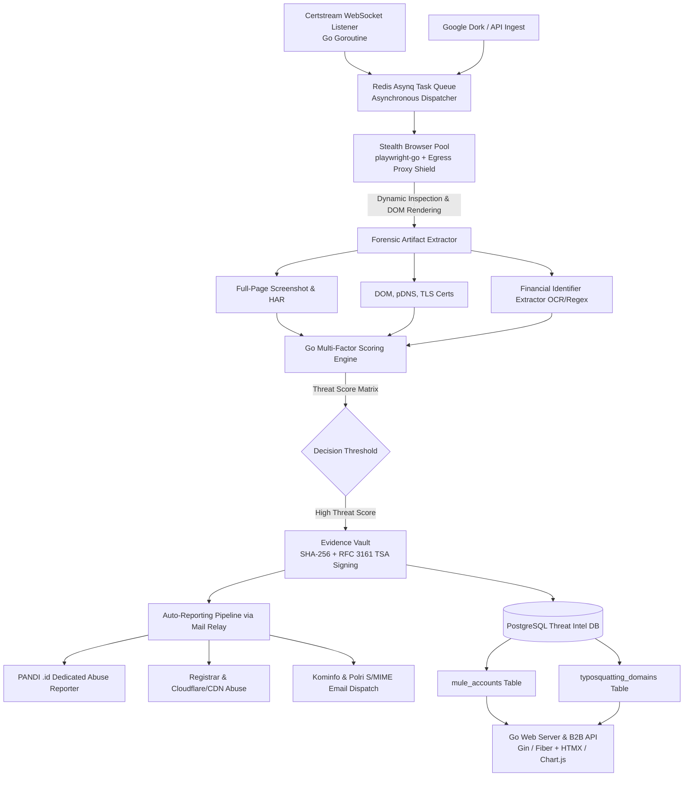

# ⚡ STRIKERR: Self-Hosted Automated Threat Hunting & Reporting Platform

<p align="center">
  
  
  
  
</p>

> **Mission Brief:** Strikerr is an industrial-grade, self-hosted threat hunting, evidence verification, and automated abuse reporting system designed to actively track, document, and neutralize online gambling (*judol*), phishing syndicates, scam APK downloads, and compromised government/academic websites (`.go.id` / `.ac.id` SEO poisoning) in Indonesia.

---

## 📌 Value & Mission Statement

Pekerjaan dan perancangan platform **Strikerr** didasari oleh misi pertahanan siber dan keadilan sosial:
1. **Melindungi Masyarakat Rentan:** Menjaga data pribadi dan tabungan masyarakat dari jeratan penipuan digital, pencurian identitas, serta sindikat phishing.
2. **Memberantas Epidemi Judi Online (Judol):** Memutus rantai akses ke situs judi online yang merusak ekonomi keluarga dan generasi muda.
3. **Membantu Penegakan Hukum & Regulasi:** Menyediakan berkas forensik digital yang bersih, sah, dan valid kepada instansi terkait (**Kominfo, Polri, CSIRT, BSSN, PANDI, serta Sektor Perbankan/OJK**).

---

## 🔥 Key Architectural Features

- 🚀 **High-Performance Go Core:** Powered by Golang `goroutines`, processing thousands of concurrent threat-hunting tasks with ultra-low memory footprint (<50MB base RAM).
- 🥷 **Decoupled Egress Proxy Shield & Anti-Bot Evasion:** Stealth browser crawling (`playwright-go`) with residential proxy rotation (Telkomsel/Biznet/Indosat ASNs) to bypass IP blocks and anti-bot measures.
- 💳 **Mule Account Extractor Engine:** High-speed Regex & OCR engine targeting Indonesian financial mule identifiers (BCA, Mandiri, BRI, BNI, DANA, OVO, GoPay, QRIS payloads).
- 📜 **Forensic Chain of Custody (RFC 3161 TSA & S/MIME):** Cryptographic integrity assurance with SHA-256 DOM hashing, full-page screenshots, and S/MIME signed PDF evidence packages.
- 😴 **Adaptive Stealth Hibernation (`stealth_hibernation.go`):** Automated 4-state hibernation engine (`NORMAL` -> `ELEVATED` -> `DEEP_HIBERNATION` -> `RECOVERY`) triggered by active host probing and canary port scans.
- 📊 **Graphical Analytics & Executive Dashboard:** Real-time SOC command center (Gin + HTMX + Tailwind CSS + Chart.js) with downloadable PDF reports.
- 🌐 **B2B Threat Intelligence Feeds:** Built-in REST API exposing STIX 2.1, JSON, and CSV feeds for bank core-banking fraud prevention.

---

## 🏗️ High-Level System Architecture



---

## 📁 Repository Structure

```
Strikerr/
├── cmd/
│   └── strikerr/
│       └── main.go                  # Application entry point
├── config/
│   └── indicators.json              # Threat indicators & regex patterns
├── internal/
│   ├── config/                      # Configuration loader (Viper)
│   ├── ingestion/                   # Certstream WebSocket & Asynq Tasks
│   ├── crawler/                     # Playwright stealth & Adaptive Hibernation
│   ├── extractor/                   # Financial mule regex & DOM parser
│   ├── database/                    # PostgreSQL GORM layer & Mule repository
│   ├── scoring/                     # Multi-factor threat scoring matrix
│   ├── vault/                       # SHA-256 Hasher & RFC 3161 TSA Client
│   ├── reporting/                   # Token-Bucket Rate Limiter & S/MIME Dispatcher
│   └── web/                         # Gin Web Server, SOC Dashboard & B2B APIs
├── Dockerfile                       # Single binary Alpine Dockerfile (~25MB)
├── docker-compose.yml               # Complete stack (Strikerr + Postgres + Redis)
├── go.mod
└── README.md
```

---

## 🚦 Quickstart & Instant Deployment (Docker Compose)

Strikerr didesain untuk dapat dijalankan secara instan menggunakan **Docker Compose**. Seluruh kontainer (Strikerr Go App, PostgreSQL Database, dan Redis Queue) akan terkonfigurasi dan berjalan secara otomatis.

### 1. Clone Repositori
```bash
git clone https://github.com/opeteer/Strikerr.git
cd Strikerr
```

### 2. Jalankan dengan Docker Compose
```bash
docker compose up -d --build
```

Setelah kontainer berjalan, buka browser dan akses Dashboard SOC Strikerr di:
👉 **`http://localhost:8080`**

---

### 🛠️ Opsional: Instalasi Manual (Lokal Tanpa Docker)

Jika Anda ingin menjalankan atau menguji aplikasi secara langsung di lingkungan lokal Go:

1. **Pastikan Dependensi Terpasang:** Go 1.22+, PostgreSQL 14+, Redis 7+.
2. **Setup Konfigurasi Environment:**
   ```bash
   cp .env.example .env
   ```
3. **Jalankan Aplikasi:**
   ```bash
   go mod download
   go run cmd/strikerr/main.go
   ```

---

## 📡 B2B Threat Intelligence API

Strikerr provides high-throughput API endpoints for integration into enterprise Bank Core Banking systems and Security Operations Centers (SOC):

| Endpoint | Method | Description | Output Format |
| :--- | :--- | :--- | :--- |
| `/api/v1/feeds/mule-accounts` | `GET` | Fetches newly identified bank & e-wallet mule accounts | STIX 2.1 / JSON / CSV |
| `/api/v1/feeds/typosquatting` | `GET` | Fetches active lookalike/phishing domains targeting brands | JSON |
| `/api/v1/lookup/account` | `POST` | Instant query endpoint for bank transfer verification | JSON |

---

## 🤝 Contributing & Community

Contributions are welcome! Please feel free to submit Pull Requests or open Issues for feature enhancements and bug fixes.

1. Fork the Project
2. Create your Feature Branch (`git checkout -b feature/AmazingFeature`)
3. Commit your Changes (`git commit -m 'Add some AmazingFeature'`)
4. Push to the Branch (`git push origin feature/AmazingFeature`)
5. Open a Pull Request

---

## ⚖️ Legal & Ethical Disclaimer

This software is designed exclusively for authorized threat hunting, cybersecurity research, and law enforcement escalation. Users are responsible for ensuring compliance with local laws and regulations governing network monitoring and abuse reporting in their respective jurisdictions.

---

<p align="center">
  Crafted with ❤️ for Cyber Safety by <a href="https://github.com/opeteer"><strong>opeteer</strong></a>
</p>
